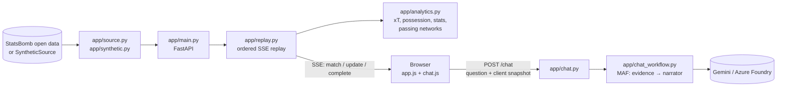
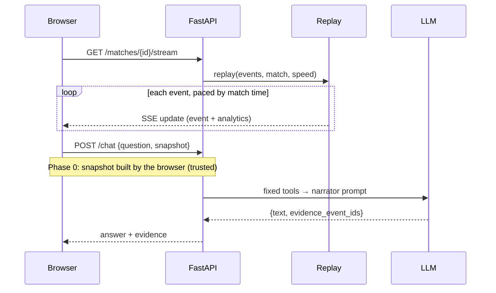

# Touchline+ architecture

_Updated at the end of every phase. Current state: **Phase 0** (Hadi Sotudeh's original Touchline, unchanged code)._

## System

```mermaid
flowchart LR
    SB[(StatsBomb open data<br/>or SyntheticSource)] --> Source[app/source.py<br/>app/synthetic.py]
    Source --> Main[app/main.py<br/>FastAPI]
    Main --> Replay[app/replay.py<br/>ordered SSE replay]
    Replay --> Analytics[app/analytics.py<br/>xT, possession, stats,<br/>passing networks]
    Replay -->|SSE: match / update / complete| Browser[Browser<br/>app.js + chat.js]
    Browser -->|POST /chat<br/>question + client snapshot| Chat[app/chat.py]
    Chat --> Workflow[app/chat_workflow.py<br/>MAF: evidence → narrator]
    Workflow --> LLM[(Gemini / Azure Foundry)]
```

## Data flow

```mermaid
sequenceDiagram
    participant B as Browser
    participant S as FastAPI
    participant R as Replay
    participant L as LLM
    B->>S: GET /matches/{id}/stream
    S->>R: replay(events, match, speed)
    loop each event, paced by match time
        R-->>B: SSE update (event + analytics)
    end
    B->>S: POST /chat {question, snapshot}
    Note over B,S: Phase 0: snapshot built by the browser (trusted)
    S->>L: fixed tools → narrator prompt
    L-->>S: {text, evidence_event_ids}
    S-->>B: answer + evidence
```
