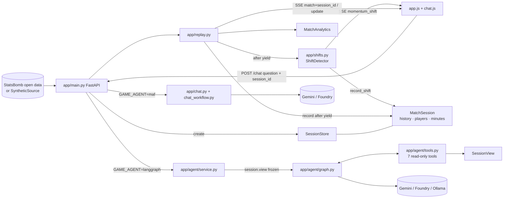
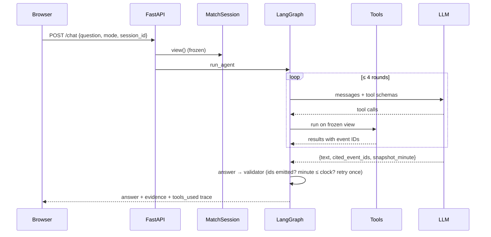
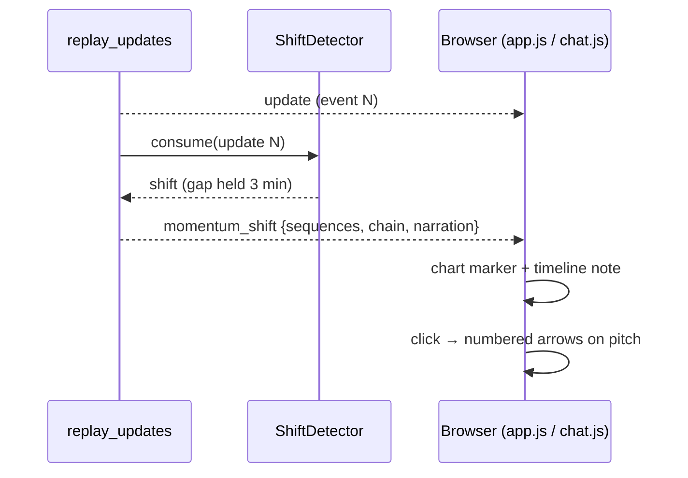

# Touchline+ architecture

_Updated at the end of every phase. Current state: **Phase 3** (explainable momentum shifts)._

## System

```mermaid
flowchart LR
    SB[(StatsBomb open data<br/>or SyntheticSource)] --> Main[app/main.py FastAPI]
    Main -->|create| Store[SessionStore]
    Main --> Replay[app/replay.py]
    Replay --> Analytics[MatchAnalytics]
    Replay -->|after yield| Shifts[app/shifts.py<br/>ShiftDetector]
    Shifts -->|SSE momentum_shift| Browser
    Shifts -->|record_shift| Session
    Replay -->|record after yield| Session[MatchSession<br/>history · players · minutes]
    Store --- Session
    Replay -->|SSE match+session_id / update| Browser[app.js + chat.js]
    Browser -->|POST /chat question + session_id| Main
    Main -->|GAME_AGENT=langgraph| Agent[app/agent/service.py]
    Agent -->|session.view frozen| Graph[app/agent/graph.py]
    Graph <--> Tools[app/agent/tools.py<br/>7 read-only tools]
    Tools --> View[SessionView]
    Graph --> LLM[(Gemini / Foundry / Ollama)]
    Main -->|GAME_AGENT=maf| MAF[app/chat.py + chat_workflow.py] --> LLM2[(Gemini / Foundry)]
```

## Data flow

```mermaid
sequenceDiagram
    participant B as Browser
    participant S as FastAPI
    participant M as MatchSession
    participant G as LangGraph
    participant T as Tools
    participant L as LLM
    B->>S: POST /chat {question, mode, session_id}
    S->>M: view() (frozen)
    S->>G: run_agent
    loop ≤ 4 rounds
      G->>L: messages + tool schemas
      L-->>G: tool calls
      G->>T: run on frozen view
      T-->>G: results with event IDs
    end
    L-->>G: {text, cited_event_ids, snapshot_minute}
    G->>G: answer → validator (ids emitted? minute ≤ clock? retry once)
    G-->>B: answer + evidence + tools_used trace
```

## Momentum shift flow (Phase 3)

```mermaid
sequenceDiagram
    participant R as replay_updates
    participant D as ShiftDetector
    participant B as Browser (app.js / chat.js)
    R-->>B: update (event N)
    R->>D: consume(update N)
    D-->>R: shift (gap held 3 min)
    R-->>B: momentum_shift {sequences, chain, narration}
    B->>B: chart marker + timeline note
    B->>B: click → numbered arrows on pitch
```
