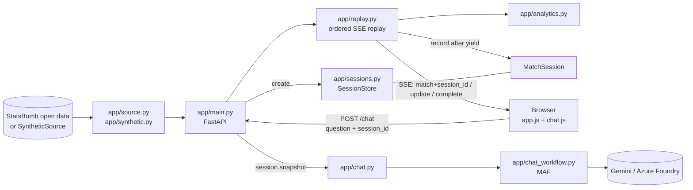
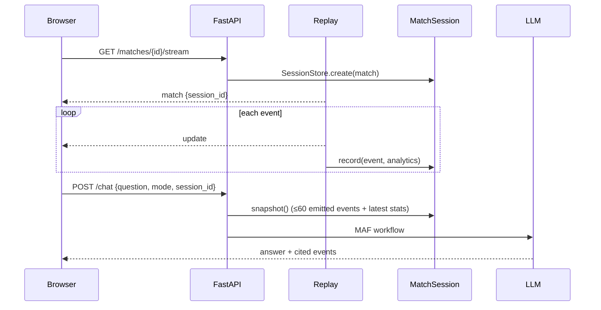

# Touchline+ architecture

_Updated at the end of every phase. Current state: **Phase 1** (server-side match sessions)._

## System

```mermaid
flowchart LR
    SB[(StatsBomb open data<br/>or SyntheticSource)] --> Source[app/source.py<br/>app/synthetic.py]
    Source --> Main[app/main.py<br/>FastAPI]
    Main -->|create| Store[app/sessions.py<br/>SessionStore]
    Main --> Replay[app/replay.py<br/>ordered SSE replay]
    Replay --> Analytics[app/analytics.py]
    Replay -->|record after yield| Session[MatchSession]
    Store --- Session
    Replay -->|SSE: match+session_id / update / complete| Browser[Browser<br/>app.js + chat.js]
    Browser -->|POST /chat<br/>question + session_id| Main
    Main -->|session.snapshot| Chat[app/chat.py]
    Chat --> Workflow[app/chat_workflow.py<br/>MAF]
    Workflow --> LLM[(Gemini / Azure Foundry)]
```

## Data flow

```mermaid
sequenceDiagram
    participant B as Browser
    participant S as FastAPI
    participant R as Replay
    participant M as MatchSession
    participant L as LLM
    B->>S: GET /matches/{id}/stream
    S->>M: SessionStore.create(match)
    R-->>B: match {session_id}
    loop each event
        R-->>B: update
        R->>M: record(event, analytics)
    end
    B->>S: POST /chat {question, mode, session_id}
    S->>M: snapshot() (≤60 emitted events + latest stats)
    S->>L: MAF workflow
    L-->>B: answer + cited events
```
