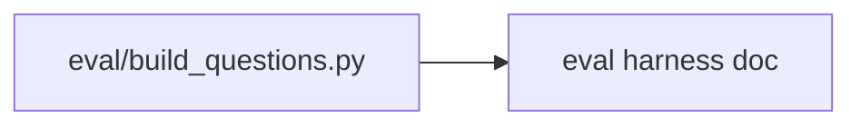

# eval/build_questions.py

Documented with the whole harness: see [eval/README.md](README.md#build_questionspy).

```mermaid
flowchart LR
    f["eval/build_questions.py"] --> doc[eval harness doc]
```
