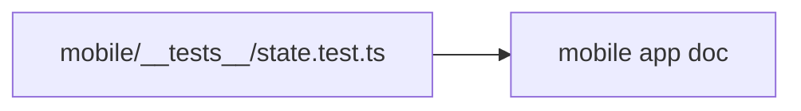

# mobile/__tests__/state.test.ts

Part of the Expo second-screen app; documented in [mobile/ overview](../README.md) (see "Files" and "Tests").

```mermaid
flowchart LR
    f["mobile/__tests__/state.test.ts"] --> doc[mobile app doc]
```
